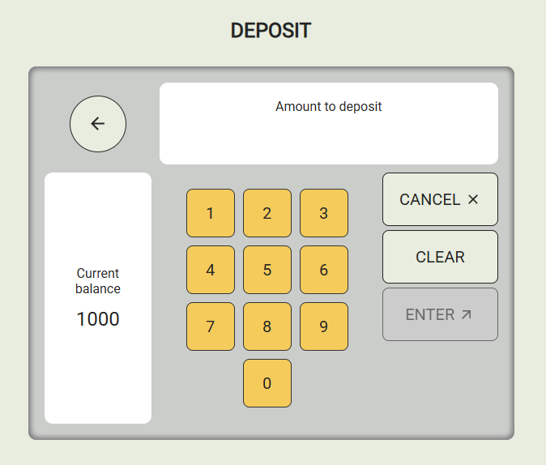

# ATM Machine — React + TypeScript + Vite

## About

This project is a simulated ATM machine interface built with **React**, **TypeScript**, and **Vite**.

## Features

- Initial screen with **Deposit** and **Withdraw** options
- Numeric keypad input with digit limit and validation
- Clear, Cancel, and Enter actions with appropriate feedback
- Confirmation modal for canceling operations
- Fake loading and success screens to simulate transaction processing
- Context-based state management for balance and transaction data
- Error handling for invalid input (e.g., zero as first digit, overdrawn withdrawals)
- Fully typed with TypeScript for maintainability and reliability

### Installation

`git clone https://github.com/krzysztofpodmokly/atm-machine.git`

`cd atm-machine`

`npm install`

#### or

`yarn install`

### Run locally

`npm run dev`

#### or

`yarn dev`

Open your browser at: [http://localhost:5173/](http://localhost:5173/)

### Run tests

`npx vitest`
